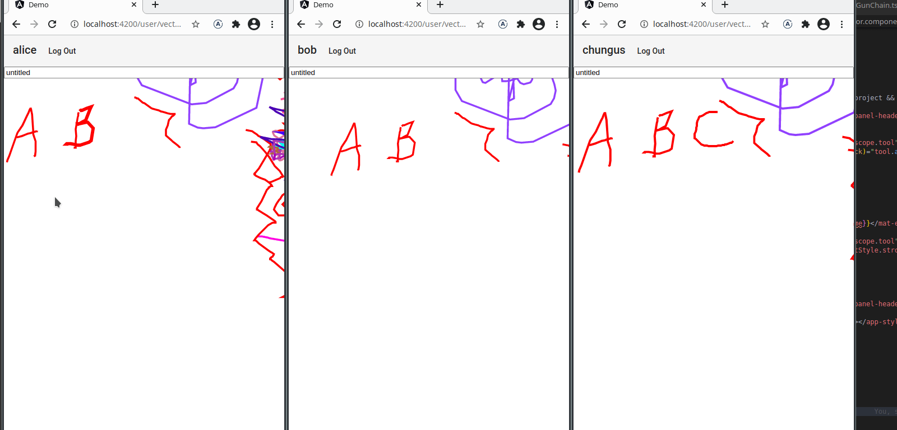

# ouronote

Real-time collaborative whiteboard web app built with [Angular](https://angular.io/), [GUN](https://gun.eco/), and [paper.js](http://paperjs.org/).



Drawings are publicly accessible (between your peers), but only users you invite may edit them.

## Running the project

### Prerequisites

**Install Required Software**

- node
- Yarn / NPM package manager
- Docker (optional)

**Clone this project**

```
git clone https://github.com/nsreed/ouronote.git

cd ouronote
```

**Install Packages**

_note: `npm` should also work for the following commands_

```
yarn install
```

### Running with Docker

**Build Projects**

```
yarn build
```

**docker-compose**

docker-compose.yml will use the project directory as a volume. This means you must have the project built before hosting.

```
yarn build demo
```

Generate self-signed certs (not required for localhost)

```
openssl req -newkey rsa:4096 -x509 -sha256 -days 365 -nodes -out ouronote-dev.crt -keyout ouronote-dev.key
```

```
docker-compose up -d
```

Navigate to https://localhost:4430 or http://localhost:8080

### Development

#### Without live reloading (recommended)

1. Run the above steps for docker-compose.
2. Run `yarn build:watch`

#### Angular CLI

For the time being, a GUN relay peer is required on `localhost:8765`.

- To run a local peer using Docker, you may either follow the instructions for docker-compose above, or run `docker run -p 8765:8765 gundb/gun`
- Or follow the [GUN Installation documentation](https://gun.eco/docs/Installation#node)

Run `ng serve`. Navigate to `http://localhost:4200/`. The app will automatically reload if you change any of the source files.

## Disclaimers

This project is in early experimental development. One could even call it a proof of concept. As such, please be aware:

- Future versions may not be backwards compatible
- Project has issues with Firefox/Safari. Chrome/chromium works best

Use at your own discretion!

## `// TODO`

- [ ] Peerless mode/peer configuration
- [ ] Cordova (or react native rewrite) for mobile/desktop
- [ ] Iris integration?
- [ ] Tests
- [ ] Non-chromium browser support
